# 🛡️ Legal Contract Risk Detector

<div align="center">


**An intelligent system for detecting and analyzing risks in legal contracts using advanced NLP and clustering techniques**

[Features](#-features) • [Architecture](#-architecture) • [Notebooks](#-notebooks) • [Performance](#-performance-metrics)

</div>

---

## 📑 Table of Contents

- [Overview](#-overview)
- [Key Features](#-features)
- [System Architecture](#-architecture)
  - [ContractRiskBERT](#1️⃣-contractriskbert)
  - [HDBSCAN Clustering](#2️⃣-hdbscan-clustering)
  - [Harris Hawks Optimizer](#3️⃣-harris-hawks-optimizer)
- [Prerequisites](#-prerequisites)
- [Notebooks](#-notebooks)
- [Model Pipeline](#-model-pipeline)
- [Examples](#-examples)
- [Performance Metrics](#-performance-metrics)
- [Results & Visualizations](#-results--visualizations)
- [Contributing](#-contributing)
- [License](#-license)
- [Citation](#-citation)
- [Contact](#-contact)

---

## 🎯 Overview

The **Legal Contract Risk Detector** is a state-of-the-art hybrid AI model designed to automatically identify, classify, and assess risks within legal contracts. By combining the power of transformer-based language models, density-based hierarchical clustering, and bio-inspired optimization, this system provides robust and accurate risk detection capabilities.

### Why This Matters

- ⚡ **Speed**: Analyze contracts in seconds, not hours
- 🎯 **Accuracy**: Deep semantic understanding of legal terminology
- 💰 **Cost-Effective**: Reduce manual review time by up to 80%
- 🔍 **Comprehensive**: Detects subtle risks that might be overlooked

---

## ✨ Features

| Feature | Description |
|---------|-------------|
| 🧠 **Deep Semantic Analysis** | Uses ContractRiskBERT to understand context and meaning of legal clauses |
| 📊 **Intelligent Clustering** | HDBSCAN groups similar risk patterns hierarchically |
| 🦅 **Optimized Performance** | Harris Hawks Optimizer fine-tunes hyperparameters automatically |
| 🎨 **Visual Risk Maps** | Interactive visualizations of risk clusters |
| 📈 **Risk Scoring** | Quantitative assessment of contract risk levels |

---

## 🏗️ Architecture

The system employs a hybrid three-stage architecture that combines state-of-the-art techniques from NLP, clustering, and optimization:

```
┌─────────────────────┐
│   Legal Contract    │
│      (Input)        │
└──────────┬──────────┘
           │
           ▼
┌─────────────────────┐
│  ContractRiskBERT   │◄─── Stage 1: Semantic Embedding
│  Transformer Model  │
└──────────┬──────────┘
           │
           │ 768-dim embeddings
           ▼
┌─────────────────────┐
│  HDBSCAN Clustering │◄─── Stage 2: Density-Based Clustering
│   (Hierarchical)    │
└──────────┬──────────┘
           │
           │ Risk clusters
           ▼
┌─────────────────────┐
│  Harris Hawks       │◄─── Stage 3: Hyperparameter Optimization
│    Optimizer        │
└──────────┬──────────┘
           │
           ▼
┌─────────────────────┐
│   Risk Assessment   │
│      Report         │
└─────────────────────┘
```

### 1️⃣ ContractRiskBERT

**ContractRiskBERT** is a fine-tuned BERT model specialized for legal contract analysis.

🔍 **Key Capabilities:**
- Processes legal text and extracts risk-relevant terms/phrases
- Generates 768-dimensional embedding vectors
- Captures semantic relationships between legal concepts
- Pre-trained on millions of legal documents
- Fine-tuned on contract risk datasets

**Technical Details:**
```python
Input: "Indemnification clause with unlimited liability"
Output: [0.23, -0.45, 0.67, ..., 0.12]  # 768-dim vector
```

The embeddings ensure that semantically similar risks (e.g., "unlimited liability" and "uncapped indemnity") are positioned close together in the vector space.

### 2️⃣ HDBSCAN Clustering

**Hierarchical Density-Based Spatial Clustering of Applications with Noise** groups risk embeddings based on density and similarity.

🎯 **Advantages:**
- **No predefined cluster count**: Automatically determines optimal number of risk categories
- **Hierarchical structure**: Creates risk taxonomy from general to specific
- **Noise handling**: Identifies outliers and unique risks
- **Density-based**: Groups risks by semantic density, not arbitrary boundaries

**Clustering Process:**
```
High-Density Regions → Core Risk Clusters
Medium-Density → Sub-risk Categories  
Low-Density → Outlier Risks (Novel/Unique)
```

### 3️⃣ Harris Hawks Optimizer

The **Harris Hawks Optimizer (HHO)** is a nature-inspired metaheuristic algorithm that mimics the hunting behavior of Harris hawks.

🦅 **Optimization Strategy:**
```
Exploration Phase → Global search for hyperparameter space
Transition Phase → Soft to hard besiege
Exploitation Phase → Intensive local search
```

**Optimized Model Hyperparameters:**
- learning_rate
- weight_decay
- dropout_rate
- attention_dropout
- warmup_ratio
- adam_epsilon
- max_grad_norm
- hidden_dropout

**Benefits:**
- ⚡ Convergence to global optima - globally best set of hyperparameters giving maximum classification F1-Score
- 🎯 Avoids local optima through exploration-exploitation balance in complex search spaces
- 🔄 Adapts to different contract types automatically

---

## 📋 Prerequisites

This project is implemented in **Google Colab** for easy access and reproducibility. To run the notebooks:

- Google account for accessing Google Colab
- Basic understanding of Python and machine learning concepts
- Familiarity with legal contract terminology (helpful but not required)

**Recommended Colab Runtime:**
- Runtime type: Python 3
- Hardware accelerator: GPU (T4 or better)
- RAM: High-RAM when available for large datasets

---

## 📓 Notebooks

The project consists of Google Colab notebooks that implement the complete pipeline:

1. **[Optimised_Legal_Risk.ipynb](https://colab.research.google.com/drive/1mhNKVVtElrUdeqOHlcfVdbMFDq7hPAkH?usp=sharing)** - Fine-tuning BERT for risk detection and hyperparameter optimization
2. **[Legal_Data_Augmentation.ipynb](https://colab.research.google.com/drive/1u6R9U15UYQ3CTnqckr00bPfhYSECm9_m?usp=sharing)** - Contract text extraction, preprocessing, and data augmentation
3. **[Optimised_Legal_Risk_Clustering.ipynb](https://colab.research.google.com/drive/1VPezHZfLRQgly3KnN-I4qqVq-UecLvOr?usp=sharing)** - HDBSCAN hierarchical clustering implementation and analysis

**Quick Start:**
```
1. Click on any notebook link above
2. It will open directly in Google Colab
3. Run all cells (Runtime → Run all)
4. Follow the instructions in each notebook
```

**Quick Start:**
```
1. Click on the notebook you want to run
2. Open in Google Colab
3. Run all cells (Runtime → Run all)
4. Follow the instructions in each notebook
```

---

## 🔄 Model Pipeline

```mermaid
graph LR
    A[Contract Document] --> B[Text Extraction]
    B --> C[Preprocessing]
    C --> D[ContractRiskBERT]
    D --> E[Embedding Vectors]
    E --> F[HDBSCAN Clustering]
    F --> G[Risk Categories]
    G --> H[HHO Optimization]
    H --> I[Refined Clusters]
    I --> J[Risk Assessment]
    J --> K[Report Generation]
```



---

## 💡 Examples

### Sample Contract Analysis

Our system automatically identifies and categorizes risks in legal contracts with color-coded severity levels:

<p align="center">
  
</p>


**Risk Color Coding:**
- 🔴 **Red** - High Risk (Confidence > 80%)
- 🟡 **Yellow** - Medium Risk (Confidence 50-80%)
- 🟢 **Green** - Low Risk (Confidence < 50%)

*Example showing automatic risk detection and highlighting in a sample employment contract*

</div>

### Identified Risk Categories

The system detects and categorizes various types of contractual risks:

| Risk Category | Severity | Example Terms |
|---------------|----------|---------------|
| 🔴 **Liability** | High | Unlimited indemnification, uncapped liability |
| 🔴 **IP Rights** | High | Broad IP assignment, work-for-hire clauses |
| 🔴 **Termination** | High | Vague termination conditions, notice periods |
| 🟡 **Non-Compete** | Medium | Restrictive geographical scope, duration |
| 🟢 **Confidentiality** | Low | Standard confidentiality terms |

---

## 📊 Performance Metrics

Our hybrid architecture achieves state-of-the-art performance on legal contract risk detection:

| Metric | Score | Description |
|--------|-------|-------------|
| **Precision** | 98.14% | Accuracy of identified risks |
| **Recall** | 97.92% | Coverage of actual risks |
| **F1-Score** | 98.03% | Harmonic mean of precision/recall |
| **Clustering Accuracy** | 96.97% | Quality of risk categorization |

### 🎨 Results & Visualizations

<div align="center">

#### Model Accuracy Over Epochs
<p align="center">
  
</p>

#### Model Precision Over Epochs
<p align="center">
  
</p>

#### Model Recall Over Epochs
<p align="center">
  
</p>

#### Model F1-Score Over Epochs
<p align="center">
  
</p>

</div>

### 🎯 Confusion Matrix

<p align="center">
  
</p>

*The confusion matrix shows excellent classification performance with minimal misclassification across risk categories*

</div>

---

## 🤝 Contributing

We welcome contributions! Please feel free to submit a Pull Request.

### How to Contribute

1. Fork the repository
2. Create your feature branch (`git checkout -b feature/AmazingFeature`)
3. Commit your changes (`git commit -m 'Add some AmazingFeature'`)
4. Push to the branch (`git push origin feature/AmazingFeature`)
5. Open a Pull Request

---

## 📄 License

This project is licensed under the MIT License - see the [LICENSE](LICENSE) file for details.

---

## 📚 Citation

If you use this project in your research, please cite:

```
To be added
```

---

## 📞 Contact

- **Author**: Manas Kamal Das
- **Email**: manaskd2019@gmail.com
- **Project Link**: [https://github.com/Manas120104/legal-contract-risk-detector](https://github.com/yourusername/legal-contract-risk-detector)

---

## 🙏 Acknowledgments

- BERT architecture by Google Research
- HDBSCAN algorithm by Campello et al.
- Harris Hawks Optimization by Heidari et al.

---

<div align="center">

**⭐ Star this repo if you find it useful! ⭐**

Made with ❤️ for the legal tech community

</div>
